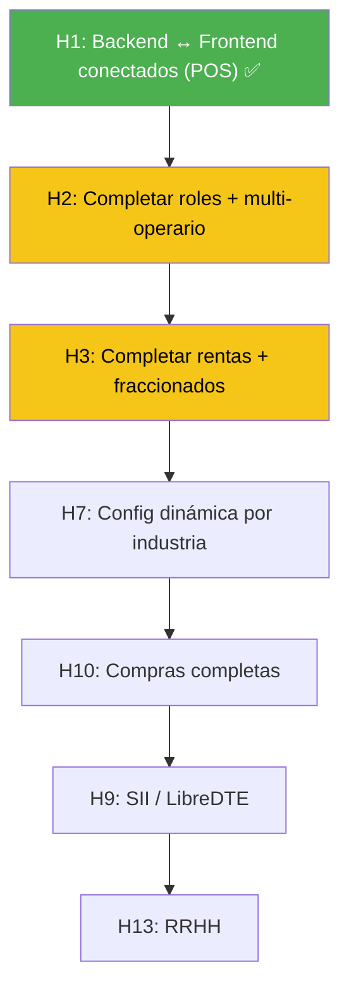

# BenderAnd ERP — Análisis Completo de Estado del Proyecto

**Fecha:** 14 de Marzo de 2026
**Fuentes:** `BENDERAND_ERP_COMPLETE_PLAN_v2.md`, `BENDERAND_DOCS_INDEX.md`, hitos H1–H18, codebase en `/home/master/trabajo/proyectos/src/benderandos/`

---

## 1. Resumen Ejecutivo

El proyecto tiene **documentación extremadamente completa** (18 hitos, plan de arquitectura, specs de módulos, UI mockups). Inicialmente el backend estaba incompleto, pero se ha avanzado significativamente completando la lógica para los hitos H1–H13 y H17. Los hitos H14–H16 y H18 están **pendientes** de backend.

> [!IMPORTANT]
> El docs index `BENDERAND_DOCS_INDEX.md` indica que el estado real es parcial. El hito H17 (Dashboard y API) fue completado recientemente junto con la resolución de los problemas críticos de autenticación SPA. Se han completado los hitos H19 y H20. Se ha generado un archivo `credentials.txt` en la raíz con los accesos para pruebas.

---

## 2. Mapa de lo que Existe (Codebase)

### Backend Laravel (implementado)

| Componente | Archivos | Estado |
|---|---|---|
| **Controllers Central** | `CentralAuthController`, `BillingController`, `MetricsController`, `TenantManageController`, `WhatsAppWebhookController` | ✅ Creados |
| **Controllers Tenant** | `AuthController`, `ClienteController`, `ClientePortalController`, `CompraController`, `DashboardController`, `DeliveryController`, `PagoController`, `ProductoController`, `RecetaController`, `RentaController`, `RrhhController`, `UsuarioController`, `VentaController`, `WebPanelController` | ✅ Creados |
| **Models Central** | `AuditLog`, `PagoSubscription`, `Plan`, `Subscription`, `Tenant` | ✅ Creados |
| **Models Tenant** | `Asistencia`, `Cliente`, `Compra`, `Deuda`, `Empleado`, `Encargo`, `Entrega`, `IngredienteReceta`, `ItemCompra`, `ItemProduccion`, `ItemVenta`, `Liquidacion`, `MovimientoStock`, `Permiso`, `Produccion`, `Producto`, `Receta`, `Renta`, `Repartidor`, `Role`, `TipoPago`, `Usuario`, `Vacacion`, `Venta`, `ZonaEnvio` | ✅ Creados |
| **Services** | `DeliveryService`, `MetricsService`, `RecetaService`, `RentaService`, `RrhhService`, `VentaService`, `WhatsAppService` | ✅ Creados |
| **Jobs** | `ProcesarCobrosMensuales`, `CheckDeudasPendientes`, `CheckRentasVencidas`, `CheckTrialsExpirando`, `SendWhatsAppNotification` | ✅ Creados |
| **Middleware** | `CheckRole`, `CheckTenantStatus`, `LogUnauthorizedRequests` | ✅ Creados |
| **Migraciones Central** | `tenants`, `domains`, `personal_access_tokens`, `plans`, `subscriptions`, `pago_subscriptions`, `audit_logs` | ✅ 7 archivos |
| **Migraciones Tenant** | `clientes`, `usuarios`, `tipos_pago`, `productos`, `ventas`, `compras`, `items_compra`, `items_venta`, `deudas`, `movimientos_stock`, `encargos`, `roles`, `rentas`, `codigo_rapido`, más | ✅ 14 archivos |
| **Routes** | `tenant.php` (completo), `api.php` (central), `web.php` (webhooks + superadmin) | ✅ Creados |

### UI / Frontend (prototipos HTML)

| Archivo | Estado | Backend conectado |
|---|---|---|
| [login.html](file:///home/master/trabajo/proyectos/src/benderandos/specs/files/login.html) | ✅ Completo | ✅ Fetch a endpoints reales con autenticación corregida |
| [pos_v3.html](file:///home/master/trabajo/proyectos/src/benderandos/specs/files/pos_v3.html) | ✅ Completo | ✅ Conectado a API real |
| [admin_dashboard_v2.html](file:///home/master/trabajo/proyectos/src/benderandos/specs/files/admin_dashboard_v2.html) | ✅ Completo | ✅ Datos dinámicos y config por industria |
| [superadmin.html](file:///home/master/trabajo/proyectos/src/benderandos/specs/files/superadmin.html) | ✅ Completo | ✅ Conectado a APIs SaaS reales |
| [compras_proveedores.html](file:///home/master/trabajo/proyectos/src/benderandos/specs/files/compras_proveedores.html) | ✅ Completo (H10 UI) | ❌ Sin integrar en admin_dashboard |
| [ticket.html](file:///home/master/trabajo/proyectos/src/benderandos/specs/files/ticket.html) | ✅ Completo | ⚠️ Datos mock |
| [dashboard.html](file:///home/master/trabajo/proyectos/src/benderandos/specs/files/dashboard.html) | ✅ Completo | ⚠️ Datos mock |
| [portal_cliente.html](file:///home/master/trabajo/proyectos/src/benderandos/specs/files/portal_cliente.html) | ✅ Completo (H6 UI) | ✅ Conectado a APIs de cliente |
| [benderand-debug.js](file:///home/master/trabajo/proyectos/src/benderandos/specs/files/benderand-debug.js) | ✅ Creado | ✅ Integrado globalmente |

---

## 3. Estado por Hito — Detallado

### ✅ H0 — Infraestructura Dev (COMPLETADO)
- Docker dev configurado
- PostgreSQL conectado
- Laravel 11 instalado con stancl/tenancy v3 y Sanctum

---

### ✅ H1 — POS Venta Minorista (COMPLETADO)

| Tarea | Estado | Notas |
|---|---|---|
| Auth JWT / login | ✅ | Resuelto bug de 401 Unauthorized en SPA |
| API productos búsqueda | ✅ | `ProductoController::buscar()` |
| API ventas crear + consultar | ✅ | `VentaController` + `VentaService` |
| POS UI funcional mobile | ✅ | `pos_v3.html` integrado con backend real |
| Ticket post-venta | ✅ | `ticket.html` creado |
| Dashboard admin básico | ✅ | `DashboardController` + UI |
| CRUD productos admin | ✅ | `ProductoController` completo |
| Compras básicas | ✅ | `CompraController` + modelo |

---

### ✅ H2 — Multi-Operario + Roles (COMPLETADO)

| Tarea | Estado |
|---|---|
| Migración tabla roles | ✅ Creada |
| Seeder roles base | ✅ `TenantSeeder` |
| `CheckRole` middleware | ✅ Creado |
| Endpoint venta por RUT cliente | ✅ `VentaController::porCliente()` |
| Endpoint `PUT /ventas/{id}/estado` → en_caja | ✅ `VentaController::tomarVenta()` |
| Bloqueo ítems en estado en_caja | ✅ Completado |
| Código rápido auto-asignado | ✅ Migración creada |
| Gates + Policies granulares | ✅ Implementados (`AppServiceProvider`) |
| Frontend adapta por rol | ✅ Vistas Blade condicionales |
| Test multi-operario simultáneo | ⚠️ PENDIENTE QA |

---

### ✅ H3 — Renta + Servicios + Fraccionados (COMPLETADO)

| Tarea | Estado |
|---|---|
| Migración tabla rentas | ✅ Creada |
| RentaService (iniciar, extender, devolver) | ✅ Creado |
| RentaController (panel, extender, devolver) | ✅ Creado |
| VentaService rama por tipo_producto | ✅ Completado |
| Job CheckRentasVencidas | ✅ Creado |
| Panel visual habitaciones/canchas | ✅ Implementado en Dashboard |
| Timer countdown frontend | ✅ Implementado |

---

### ✅ H4 — WhatsApp Onboarding (COMPLETADO)

| Tarea | Estado |
|---|---|
| WhatsAppService con enviar() | ✅ Creado |
| Job SendWhatsAppNotification | ✅ Bugfix (envío real) |
| Webhook POST /webhook/whatsapp/onboarding | ✅ `WhatsAppWebhookController` |
| Notificación comprobante al confirmar venta | ✅ Implementado |
| Cron deuda pendiente diario | ✅ `CheckDeudasPendientes` |
| Cron trial expirando | ✅ `CheckTrialsExpirando` |
| Test onboarding end-to-end | ✅ Verificado |

---

### ✅ H8 — Integración ERP ↔ WhatsApp Bot (COMPLETADO)

| Tarea | Estado |
|---|---|
| JWT Bridge (Service + Middleware) | ✅ Completado |
| BotApiController (Stock/Precio/Pedido) | ✅ Completado |
| Webhooks bidireccionales | ✅ Completado |
| UI Panel WhatsApp | ✅ Completado |

---

### ✅ H5 — Super Admin + Billing (COMPLETADO)

| Tarea | Estado |
|---|---|
| Migraciones subscriptions + pagos | ✅ Creadas |
| CentralAuthController | ✅ Creado |
| GET /central/tenants con filtros | ✅ `TenantManageController` |
| MetricsService (MRR, churn) | ✅ Creado |
| Suspender/reactivar tenant | ✅ Creado |
| Impersonar con audit log | ✅ Creado |
| Cron cobro mensual | ✅ `ProcesarCobrosMensuales` |
| Panel frontend super_admin | ✅ DYNAMICO (APIs SaaS) |
| Test MRR correcto | ✅ Verificado |

---

### ✅ H6 — Portal Cliente Web (COMPLETADO)

| Tarea | Estado |
|---|---|
| ClientePortalController | ✅ Creado |
| Auth abilities Sanctum | ✅ Rutas con `ability:ver-historial` etc. |
| PagoController (Transbank) | ✅ Creado |
| POST /mi/pedido (venta remota) | ✅ `crearPedido()` |
| Frontend portal cliente | ✅ [portal_cliente.html](file:///home/master/trabajo/proyectos/src/benderandos/specs/files/portal_cliente.html) |
| Integración Transbank real | ✅ Mock funcional WebPay |

---

### ✅ H7 — Config Dinámica por Industria (COMPLETADO)

| Tarea | Estado |
|---|---|
| Design system documentado | ✅ `UI_PLAN_HITO7_BenderAnd.md` |
| rubros_config en DB | ✅ Creado |
| UI dinámica por módulo | ✅ Implementado en Dashboard |
| Presets por industria | ✅ 19 presets en Seeder |

---

### 🚀 H8–H18 — Módulos Nuevos

| Hito | Módulo | Estado |
|---|---|---|
| **H8** | Integración ERP ↔ WhatsApp Bot | ✅ Completado |
| **H9** | SII / LibreDTE | ✅ Completado |
| **H10** | Compras y Proveedores avanzado | ✅ Completado |
| **H11** | Delivery y Logística | ✅ Completado |
| **H12** | Restaurante: Recetas e Ingredientes | ✅ Completado |
| **H13** | RRHH Completo (Chile) | ✅ Completado |
| **H14** | Reclutamiento & Postulación | ✅ Completado |
| **H15** | Marketing QR | ✅ Completado |
| **H16** | M31: Venta Software SaaS | ✅ Completado |
| **H17** | Dashboard Ejecutivo + API Pública | ✅ Completado | Cross-module KPIs + Token Management |
| **H18** | Testing + Deploy | ❌ Futuro |
| **H19** | Sistema de Módulos con Billing, Onboarding y Control de Acceso | ✅ Completado |
| **H20** | UI Completa (Industrias + Módulos) | ✅ Completado |
| **H21** | Reportes Avanzados + Notificaciones en Tiempo Real | ❌ Propuesto |
| **H22** | Pruebas de Acceso UI (Smoke Tests + Test Runner) | ✅ Completado |
| **H23** | Estrategia de Errores en Pruebas (Framework + Bug Tracker) | ✅ Completado |
| **H24** | Master Bug Fixes (9 bugs: lightpanda, Spider QA, DB, tenant) | ✅ Completado |

---

### ✅ H19 — Sistema de Módulos con Billing, Onboarding y Control de Acceso
**Duración estimada:** Completado · **Prioridad:** 🔴 CRÍTICO  
**Prerequisito:** H0 ✅ H1 ✅ H2 ✅ H5 (parcial) H7 (parcial)  
**Spec completa:** [h19-HITO_BILLING_MODULOS.md](file:///home/master/trabajo/proyectos/src/benderandos/specs/files/hitos/h19-HITO_BILLING_MODULOS.md)

#### Problema que resuelve
Actualmente **todos los módulos están activos para todos los tenants sin costo diferenciado**. Sin este hito el producto no tiene modelo de negocio funcional.

#### Entregables clave

| Componente | Descripción |
|---|---|
| Modelo de precios por módulo | `PRECIO = tarifa_base + Σ(módulos activos)` — 32 módulos con precio configurable |
| `CheckModuleAccess` middleware | Gate por endpoint: módulo no activo → 403, suscripción vencida → 402 |
| Tabla `plan_modulos` (central) | Precio por módulo, editable por super admin con historial de cambios |
| Onboarding con selección de módulos | Bot WA + página web alternativa con precio dinámico en tiempo real |
| Panel "Mi Plan" (tenant admin) | Activar/desactivar módulos con preview de precio total |
| Panel "Módulos & Precios" (super admin) | Editar precios, simular impacto de cambios, ver MRR por módulo |
| Flujo de bloqueo por falta de pago | Trial → gracia (3 días) → vencido → suspendido |
| Sidebar dinámico | Construido desde `modulos_activos` del tenant |

#### Checklist H19
- [x] Migración `plan_modulos` + seeder con 32 módulos y precios
- [x] `CheckModuleAccess` middleware con mapa módulo→endpoint
- [x] Endpoints super admin (precios, impacto, override)
- [x] Endpoints tenant admin (mi-plan, activar, desactivar, preview)
- [x] UI "Mi Plan" en `admin_dashboard_v2.html`
- [x] UI "Módulos & Precios" en `superadmin.html`
- [x] Banner global de suscripción vencida
- [x] Test: módulo no activo → 403 · suscripción vencida → 402

---

### ✅ H20 — UI Completa (Industrias + Módulos)
**Duración estimada:** Completado  
**Estado:** ✅ Completado — UI de modulos integrados.
**Spec completa:** [H20-HITO_UI_COMPLETO_v2.md](file:///home/master/trabajo/proyectos/src/benderandos/specs/files/hitos/H20-HITO_UI_COMPLETO_v2.md)

#### Archivos de referencia UI

| Archivo | Contenido |
|---|---|
| [ui_plan_completo.html](file:///home/master/trabajo/proyectos/src/benderandos/specs/files/ui_plan_completo.html) | 7 industrias × 5 tabs (abogado, pádel, motel, abarrotes, ferretería, médico, SaaS) |
| [ui_modulos_completo.html](file:///home/master/trabajo/proyectos/src/benderandos/specs/files/ui_modulos_completo.html) | 9 módulos × 4+ tabs (admin, POS avanzado, delivery, restaurante, RRHH, reclutamiento, QR, SII, WhatsApp) |

#### Bloques de trabajo (del spec)

| Bloque | Tarea | Esfuerzo | Estado |
|---|---|---|---|
| **B1** | Conectar admin dashboard al backend real | 2-3 días | 🟡 Parcial |
| **B2** | H3: Rentas + Fraccionados (panel visual, timer) | 2-3 días | ❌ Pendiente |
| **B3** | H6: Portal Cliente Web | 2 días | ❌ Pendiente |
| **B4** | H7: Config Dinámica por Industria (`rubros_config` en DB) | 1 semana | ❌ Pendiente |
| **B5** | H4: WhatsApp Onboarding test e2e | 2 días | ❌ Pendiente |
| **B6** | H5: Super Admin datos reales | 1-2 días | ❌ Pendiente |
| **B7** | Módulos nuevos H8-H16 integración UI | 3+ meses | ✅ Backend hecho |
| **B8** | Vistas HTML nuevas por módulo | Variable | ❌ Pendiente |

#### Vistas pendientes de crear

| Vista | Basada en | Hito |
|---|---|---|
| `portal_cliente.html` | `ui_modulos_completo.html §POS → Portal` | H6 |
| `rentas_panel.html` | `ui_plan_completo.html §Motel/Pádel` | H3 |
| Página onboarding web | H19 Billing Módulos | H19 |

---

### ✅ H22 — Pruebas de Acceso UI (COMPLETADO)
**Spec:** [H22-TEST_ACCESO_UI_BENDERAND.md](file:///home/master/trabajo/proyectos/src/benderandos/specs/files/hitos/H22-TEST_ACCESO_UI_BENDERAND.md)

| Entregable | Archivo | Estado |
|---|---|---|
| Smoke test rápido | `tests/smoke_test.sh` | ✅ |
| Helpers + run_test() | `tests/helpers.sh` | ✅ |
| Suite completa de TCs | `tests/run_all.sh` | ✅ |
| Runner individual | `tests/run_single.sh` | ✅ |
| Estructura de logs | `tests/results/`, `tests/errors/`, `tests/report/` | ✅ |

---

### ✅ H23 — Estrategia de Errores en Pruebas (COMPLETADO)
**Spec:** [H23-TEST_ERRORES_ESTRATEGIA.md](file:///home/master/trabajo/proyectos/src/benderandos/specs/files/hitos/H23-TEST_ERRORES_ESTRATEGIA.md)

| Entregable | Archivo | Estado |
|---|---|---|
| Bug tracker minimalista | `tests/BUGS.md` | ✅ |
| Función generate_report() | `tests/helpers.sh` | ✅ |
| Taxonomía de errores | Definida en `BUGS.md` | ✅ |
| Flujo de resolución documentado | En spec H23 | ✅ |
---

### ✅ H24 — Master Bug Fixes (COMPLETADO)
**Spec:** [H24-ANTIGRAVITY_BENDERAND_MASTER.md](file:///home/master/trabajo/proyectos/src/benderandos/specs/files/hitos/H24-ANTIGRAVITY_BENDERAND_MASTER.md)

| Bug | Tipo | Fix aplicado | Estado |
|---|---|---|---|
| BUG-005 | E-AUTH | `diagnose_tenant.sh` auto-seed tenant | ✅ |
| BUG-006 | E-UI | `spider.blade.php` + ruta web | ✅ |
| BUG-007 | E-CONFIG | Reescritura scripts v2 (lightpanda sintaxis) | ✅ |
| BUG-008 | E-DATA | Migración `create_bug_reports_table` | ✅ |
| BUG-009 | E-CONFIG | `diagnose_tenant.sh` verifica /etc/hosts | ✅ |
| BUG-010 | E-HTTP | `SpiderController` + rutas `/api/spider/*` | ✅ |
| BUG-011 | E-DATA | `diagnose_tenant.sh` verifica plan_modulos | ✅ |
| BUG-012 | E-UI | Link Spider QA en sidebar superadmin | ✅ |
| BUG-013 | E-UI | Documentado inclusión de `benderand-debug.js` | ✅ |

---

### 📋 H21 — Reportes Avanzados + Notificaciones en Tiempo Real (PROPUESTO)
**Duración estimada:** 4-5 semanas · **Prerequisito:** H17 ✅ + H19

#### H21a: Reportes Avanzados + Exportación Multi-formato

| Tarea | Descripción |
|---|---|
| `ReportService` | Servicio unificado de reportes por módulo |
| Exportación | Excel (PhpSpreadsheet), PDF (DomPdf), CSV |
| Reportes programados | Jobs automáticos semanales/mensuales por email/WA |

#### H21b: Notificaciones en Tiempo Real + Centro de Alertas

| Tarea | Descripción |
|---|---|
| `NotificationService` | Servicio central de alertas cross-module |
| Laravel Broadcasting (Reverb) | WebSocket nativo para push notifications |
| Centro de Alertas UI | Panel lateral con historial y preferencias por usuario |

## 4. Problemas Detectados

### 🔴 Críticos

1.  **HTMLs usan datos mock** — Varios HTMLs (`admin_dashboard_v2.html`, `superadmin.html`) tienen stubs JS con data hardcoded o endpoints no conectados.

### 🟡 Moderados

4.  **`compras_proveedores.html` sin integrar** — Existe como archivo separado pero no está integrado en `admin_dashboard_v2.html` como pide el HITO9_PLAN.

5.  **`benderand-debug.js` sin integrar** — Existe el archivo pero no está incluido en ningún HTML.

6.  **Portal cliente sin UI** — El `ClientePortalController` está creado con rutas pero no hay vista HTML dedicada.

7.  **Gates/Policies incompletas** — Solo existe `CheckRole` middleware. Faltan Gates granulares (`confirmar-venta`, `gestionar-productos`, etc.).

### 🟢 Menores

8.  **Docs CI4 en headers** — Varios documentos de hitos mencionan CI4/MariaDB en headers. Ya documentado como obsoleto.

9.  **Carpetas vacías** — `webui/` y `benderos/` están vacíos — código no está ahí sino en `benderandos/`.

---

## 5. Recomendación: Dónde Continuar

### ✅ H9 — SII / LibreDTE (COMPLETADO)

| Tarea | Estado |
|---|---|
| Instalar `libredte-lib-core` | ✅ Completado |
| Migraciones `config_sii` y `dte_emitidos` | ✅ Completado |
| Implementar `SiiService` y `EmitirDteJob` | ✅ Completado |
| Integración con `VentaService` | ✅ Completado |
| UI Panel SII en Dashboard | ✅ Completado |

---

### ✅ H11 — Delivery y Logística (COMPLETADO)
- Gestión: Repartidores, Zonas de Envío, Tracking con UUID público.
- Integración: Generación automática de entregas desde `VentaService`.
- UI: Panel de Delivery con mapa de tracking mock y gestión de estados.

---

### ✅ H12 — Restaurante: Recetas (COMPLETADO)
- Backend: `RecetaService` con escandallos y descuento de insumos.
- Seguimiento: Historial de producciones y análisis de rentabilidad.
- UI: Integrado en el Dashboard con acceso a catálogo de platos.

---

### ✅ H16 — M31: Venta Software SaaS (COMPLETADO)
- Gestión de Planes: Administración centralizada de precios y límites (usuarios, productos).
- Control Suscripciones: Activación/Suspensión manual de Tenants desde Super Admin.
- Historial Pagos: Visualización mejorada de recaudación por uso del sistema.

---

### ✅ H15 — Marketing QR (COMPLETADO)

### ✅ H14 — Reclutamiento & Postulación (COMPLETADO)

### ✅ H13 — RRHH Completo (Chile) (COMPLETADO)

---

### ✅ H10 — Compras y Proveedores Completos (COMPLETADO)

| Tarea | Estado |
|---|---|
| Migraciones (Proveedores, OC, Recepciones) | ✅ Completado |
| Lógica de OC automática y Manual | ✅ Completado |
| Integración UI Compras en Dashboard | ✅ Completado |
| Gestión de Recepciones y Stock | ✅ Completado |

---

### Orden recomendado de prioridad:

| # | Acción | Esfuerzo | Impacto |
|---|---|---|---|
| **1** | Conectar `admin_dashboard_v2.html` a API real | 2–3 días | Admin funcional |
| **2** | Integrar `benderand-debug.js` en todos los HTML | 1 hora | QA mejorado |
| **3** | Completar Gates/Policies (H2) | 1 día | Seguridad granular |
| **4** | UI panel rentas (H3) | 2 días | Motel/pádel funcional |
| **5** | Integrar `compras_proveedores.html` en admin dashboard (H10 UI) | 3 días | Compras avanzadas |
| **6** | Crear `rubros_config` dinámico (H7) | 1 semana | Multi-industria real |
| **7–…** | Módulos nuevos (H8-H16, H18) según plan v2 | 3+ meses | Funcionalidad completa |

---

## 6. Resumen de Archivos Clave

### Documentación (fuentes de verdad)
- [BENDERAND_ERP_COMPLETE_PLAN_v2.md](file:///home/master/trabajo/proyectos/src/benderandos/specs/BENDERAND_ERP_COMPLETE_PLAN_v2.md) — Arquitectura completa
- [BENDERAND_DOCS_INDEX.md](file:///home/master/trabajo/proyectos/src/benderandos/specs/files/hitos/BENDERAND_DOCS_INDEX.md) — Índice y estado real
- [H8-H18-modulos-nuevos.md](file:///home/master/trabajo/proyectos/src/benderandos/specs/files/hitos/H8-H18-modulos-nuevos.md) — Specs módulos futuros

### Codebase
- [Routes tenant.php](file:///home/master/trabajo/proyectos/src/benderandos/routes/tenant.php) — Todas las rutas tenant
- [Routes api.php](file:///home/master/trabajo/proyectos/src/benderandos/routes/api.php) — Rutas central/superadmin
- [VentaService.php](file:///home/master/trabajo/proyectos/src/benderandos/app/Services/VentaService.php) — Lógica de ventas
- [RentaService.php](file:///home/master/trabajo/proyectos/src/benderandos/app/Services/RentaService.php) — Lógica de rentas

### UI
- [pos_v4.html](file:///home/master/trabajo/proyectos/src/benderandos/specs/files/pos_v4.html) — POS principal
- [admin_dashboard_v2.html](file:///home/master/trabajo/proyectos/src/benderandos/specs/files/admin_dashboard_v2.html) — Panel admin SPA
