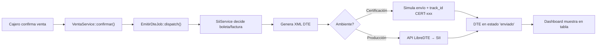

# Walkthrough - Hito 9: SII / LibreDTE — Facturación Electrónica

Se implementó el módulo completo de facturación electrónica integrado con el SII de Chile, con dashboard de administración, emisión automática y tests de integración.

## Archivos Creados

### Database
- [create_config_sii_table.php](file:///home/master/trabajo/proyectos/src/benderandos/database/migrations/tenant/2026_03_14_240000_create_config_sii_table.php) — Configuración SII con campos encriptados
- [create_dte_emitidos_table.php](file:///home/master/trabajo/proyectos/src/benderandos/database/migrations/tenant/2026_03_14_240100_create_dte_emitidos_table.php) — Tracking de DTEs emitidos

### Models
- [ConfigSii.php](file:///home/master/trabajo/proyectos/src/benderandos/app/Models/Tenant/ConfigSii.php) — Config con encrypt de certificado y API key
- [DteEmitido.php](file:///home/master/trabajo/proyectos/src/benderandos/app/Models/Tenant/DteEmitido.php) — Constantes tipo 33/39/61, scopes, relaciones

### Services
- [SiiService.php](file:///home/master/trabajo/proyectos/src/benderandos/app/Services/SiiService.php) — Emisión boleta/factura/NC, consulta estado, libro ventas, generación XML
- [EmitirDteJob.php](file:///home/master/trabajo/proyectos/src/benderandos/app/Jobs/EmitirDteJob.php) — Job async con retry y verificación idempotente

### Controller & Routes
- [SiiController.php](file:///home/master/trabajo/proyectos/src/benderandos/app/Http/Controllers/Tenant/SiiController.php) — 9 endpoints: dashboard, CRUD, libro ventas, config

### UI
- [sii.blade.php](file:///home/master/trabajo/proyectos/src/benderandos/resources/views/tenant/admin/sii.blade.php) — Dashboard con tabs: DTEs, Libro Ventas, Configuración SII

### Tests
- [SiiServiceTest.php](file:///home/master/trabajo/proyectos/src/benderandos/tests/Feature/SiiServiceTest.php) — 8 test cases cubriendo flujos principales

## Archivos Modificados

| Archivo | Cambio |
|---|---|
| [VentaService.php](file:///home/master/trabajo/proyectos/src/benderandos/app/Services/VentaService.php) | `EmitirDteJob::dispatch()` al confirmar venta |
| [Venta.php](file:///home/master/trabajo/proyectos/src/benderandos/app/Models/Tenant/Venta.php) | Relación `dtes()` |
| [tenant.php](file:///home/master/trabajo/proyectos/src/benderandos/routes/tenant.php) | Rutas SII API + admin view |
| [layout.blade.php](file:///home/master/trabajo/proyectos/src/benderandos/resources/views/tenant/layout.blade.php) | Link "Facturación SII" en sidebar |

## Flujo de Integración

## Endpoints API

| Método | Ruta | Descripción |
|---|---|---|
| GET | `/api/sii/dashboard` | KPIs diarios |
| GET | `/api/sii/dtes` | Lista paginada con filtros |
| GET | `/api/sii/dtes/{id}` | Detalle DTE con XML |
| POST | `/api/sii/emitir/{ventaId}` | Emisión manual |
| POST | `/api/sii/nota-credito/{dteId}` | Nota de crédito |
| POST | `/api/sii/consultar-estado/{dteId}` | Consultar SII |
| GET | `/api/sii/libro-ventas` | Libro mensual |
| GET | `/api/sii/config` | Leer configuración |
| PUT | `/api/sii/config` | Guardar configuración |

> [!NOTE]
> Los tests están marcados como `markTestSkipped()` porque requieren contexto de tenant con migraciones aplicadas. Están listos para ejecutarse con el helper de tenancy.
